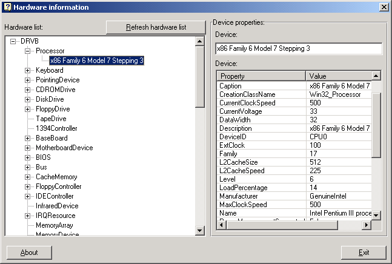

## Get hardware information using WMI

### Description

This code displays information about (almost) all your hardware devices using the WMI library (Windows Management Instrumentation). It also displays all the properties for each hardware device.
 
### More Info
 
Requirements:

Windows Me, 2000 and XP - there are no special requirements.

If you're using Windows NT4, 95 or 98: the WMI must be installed on your system.

You can download it from the following link:

http://msdn.microsoft.com/library/default.asp?url=/downloads/list/wmi.asp

             |
---                |---
**Submitted On**   |2003-04-20 23:54:40
**By**             |[Yaniv D\.](https://github.com/Planet-Source-Code/PSCIndex/blob/master/ByAuthor/yaniv-d.md)
**Level**          |Intermediate
**User Rating**    |4.8 (87 globes from 18 users)
**Compatibility**  |VB 5\.0, VB 6\.0
**Category**       |[Windows System Services](https://github.com/Planet-Source-Code/PSCIndex/blob/master/ByCategory/windows-system-services__1-35.md)
**World**          |[Visual Basic](https://github.com/Planet-Source-Code/PSCIndex/blob/master/ByWorld/visual-basic.md)
**Archive File**   |[Get\_hardwa158533582003\.zip](https://github.com/Planet-Source-Code/yaniv-d-get-hardware-information-using-wmi__1-45360/archive/master.zip)

